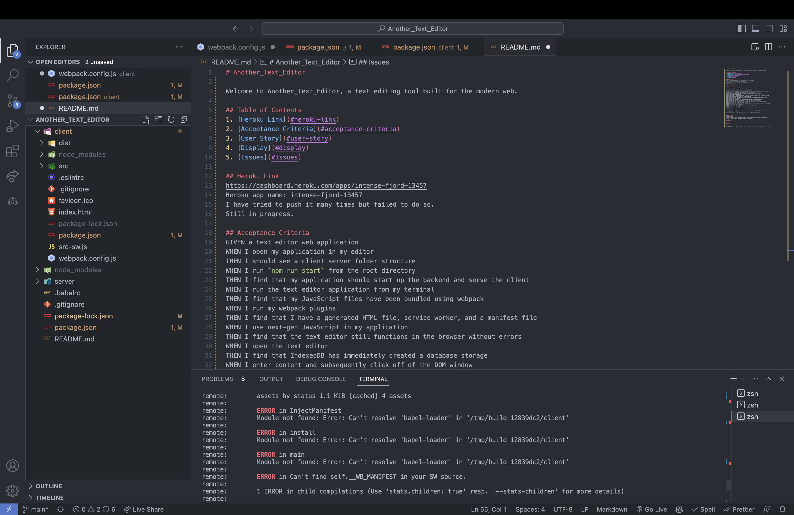

# Another_Text_Editor :pencil2:
Welcome to Another_Text_Editor :rocket:, a modern and robust text editing tool built for the web. Designed to provide a seamless user experience while offering functionality at its core.

## Table of Contents
1. [Project Deployment](#project-deployment)
2. [Features](#features)
3. [User Story](#user-story)
4. [App Visualization](#app-visualization)
5. [Known Issues](#known-issues)
6. [Troubleshooting](#troubleshooting)

## Project Deployment :rocket:
This project is currently hosted on [Heroku](https://dashboard.heroku.com/apps/intense-fjord-13457).

**Heroku app name**: intense-fjord-13457

Deployment is still a work in progress. For local deployment, please see the Features section below.

## Features :sparkles:
The acceptance criteria for the functionality of our application is as follows:

- A structured client-server folder layout for easy navigation.
- Convenient startup of the backend server and client serving on running `npm run start`.
- Bundling of JavaScript files using Webpack.
- Generation of HTML file, service worker, and manifest file on running Webpack plugins.
- Support for next-gen JavaScript without browser errors.
- Immediate creation of IndexedDB database storage upon opening the text editor.
- Content saving with IndexedDB when clicking off of the DOM window.
- Content retrieval from IndexedDB on reopening the text editor.
- App installation as a desktop icon on clicking the Install button.
- Registered service worker using Workbox on app loading.
- Precached static assets and subsequent pages upon service worker registration.
- Proper build scripts for a Webpack application on Heroku deployment.

## User Story :books:
AS A developer,  
I WANT to create notes or code snippets with or without an internet connection,  
SO THAT I can reliably retrieve them for later use.

## App Visualization :framed_picture:
**Installing & Uninstalling the app**

**Service Worker & App Manifest**

## Known Issues :bug:
During the development of this project, we encountered a few issues:
- IndexedDB not functioning as expected
- Difficulty in pushing the app to Heroku

**Here is a visual overview of the issues we faced:**

## Troubleshooting :wrench:
Here are the steps we've taken in attempting to resolve the issues:

1. Performed a fresh install of the node modules with `npm rm -rf node_modules` and `npm install`.
2. Restarted the build process with `npm run build` and `npm run start`.
3. Modified `babel-loader` and `babel-core` by removing the hat symbol from the package.json file.
4. Adjusted the `webpack.config.js` file.
5. Attempted to troubleshoot the Babel error displayed in the console.

Stay tuned for updates as we continue to work towards resolving these issues. :hammer_and_wrench:
